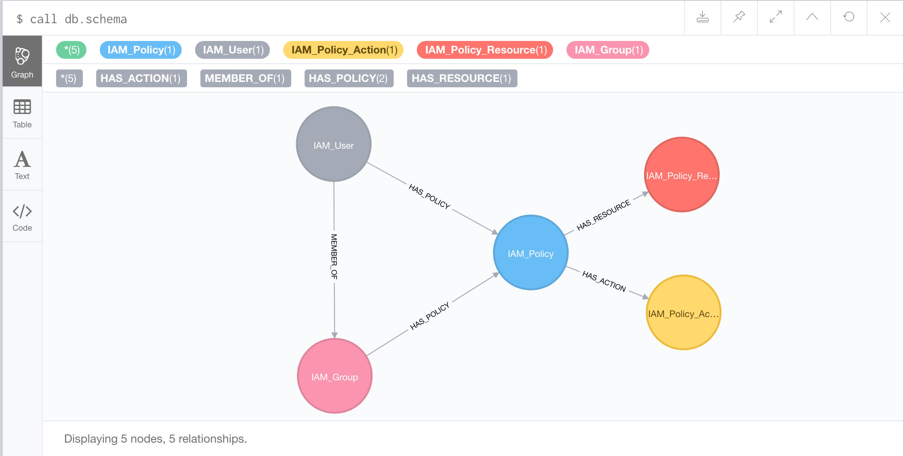

# aws-iam-neo4j

## Export IAM Settings of you accout

Run the following command to extract all your AWS IAM settings:

```
aws iam get-account-authorization-details > account_auth.json
```

## Graph Schema




## Relevant Cypher Queries

TDB